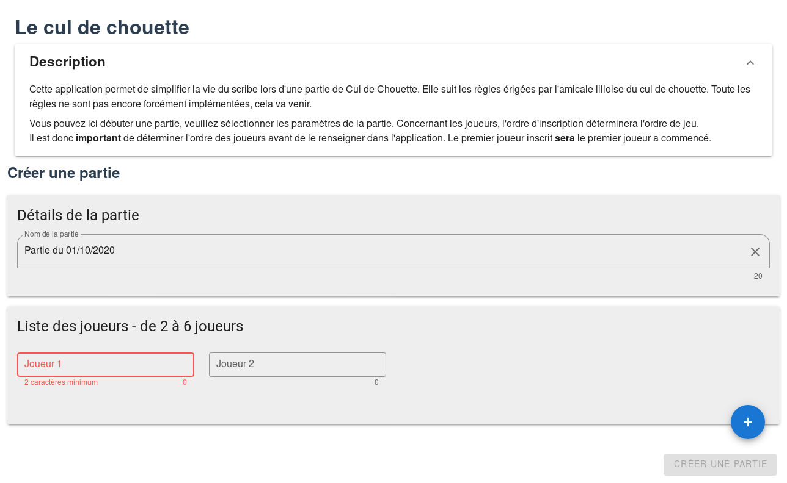
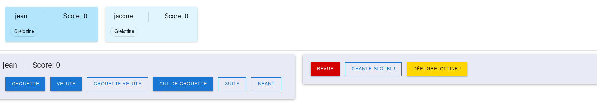

# Awesome README [](https://github.com/sindresorhus/awesome#readme)

# cul-de-chouette

## Project setup
```
npm install
```

### Compiles and hot-reloads for development
```
npm run serve
```

### Compiles and minifies for production
```
npm run build
```

### Run your unit tests
```
npm run test:unit
```

### Lints and fixes files
```
npm run lint
```

### Customize configuration
See [Configuration Reference](https://cli.vuejs.org/config/).


## French part 

### Utilisation

<h1 align="center">
  
  <br />
  Page d'accueil actuelle.
</h1>

Les règles du jeu sont disponibles ici : [règles](https://docs.google.com/document/d/111XDCFHeqVqV-DvnJqJ31rp05tMZbmpxJWQDvPJdIHY/edit)

Sur cette interface, vous pouvez voir la description du projet.

Plusieurs champs sont a saisir : 
- Détails de la partie
- Liste des joueurs (avec le bouton plus pour ajouter un joueur, et l'icone de poubelle pour en supprimer un).


Une fois ces éléments saisie, vous pouvez lancer la partie.

<h1 align="center">
  
  <br />
  Ecran principale d'une partie.
</h1>
